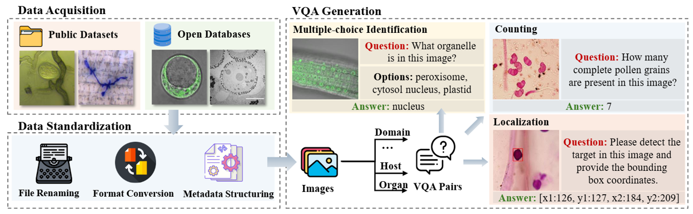

# Benchmarking Vision-Language Models for Microscopic Plant Image Understanding

Official repository for the paper: [Benchmarking Vision-Language Models for Microscopic Plant Image Understanding](https://arxiv.org/abs/2606.22497)

## Introduction
Microscopic imaging is essential for studying plant biology and pathology at cellular and subcellular levels, yet VLM benchmarks have largely focused on macroscopic plant images. To address this gap, we present PlantMicro, a benchmark for evaluating VLMs on microscopic plant imagery. PlantMicro contains over 5,000 images and more than 9,000 VQA pairs, covering diverse hosts, biological domains, and imaging modalities.

  

### Curation of our dataset

  

### Dataset Access
PlantMicro is accessible through:
[Google Drive](https://drive.google.com/file/d/1lAL4rVOw2gcRDQPasd12VSnBhW6LS6Hp/view?usp=drive_link)
