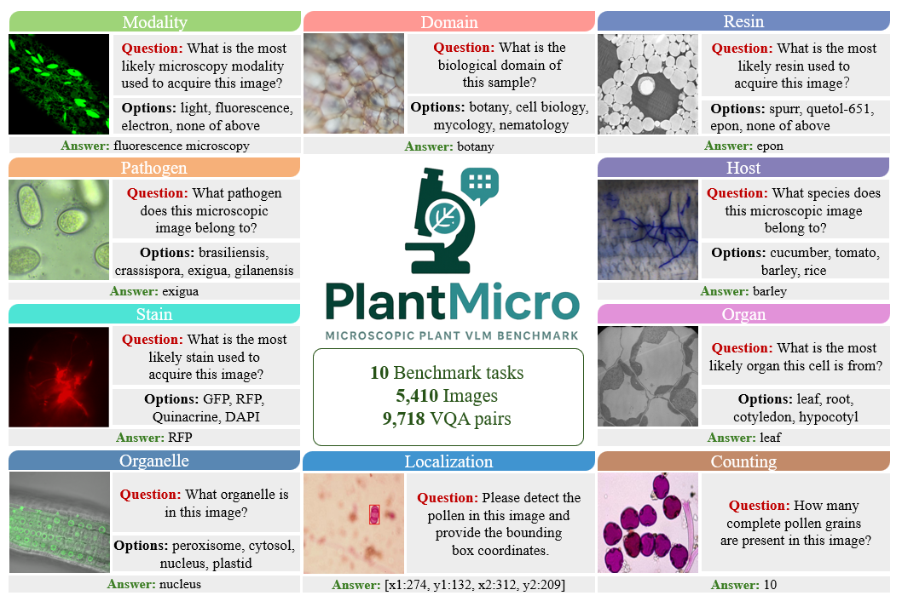

# PlantMicro

Official repository for the paper:

## Benchmarking Vision-Language Models for Microscopic Plant Image Understanding

**Accepted at ECCV 2026**

PlantMicro is a benchmark for evaluating vision-language models on microscopic plant image understanding tasks.

  

🚧 **PlantMicro will be released upon publication.**
